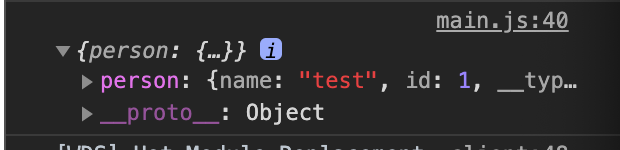

# apollo-link-rest example

## Concepts

The issue that our team is a lot of getting data from rest api.
A lot of data from rest api isn't neccessary for development.
I considered solve this issue effciently, I found `apollo-link-rest` from google.
I thought it is useful to solving issue, So I developed this example.
I refered to [apollo documentation](https://www.apollographql.com/docs/link/links/rest/)

## Usage

To run example, you have to use two terminals
One terminal is using webpack, another one is express (api server).

```bash
// excute webpack
npm run dev

// run api server
npm run start:dev
```

Connect to `localhost:4001`. `4001` port is webpack-dev-server port. Api server use port 4000.
Open `chrome dev tools` console, you can see the data `person`.



## Contributions & Issues

If you want to pull request, fork this [repo](https://github.com/trustyoo86/alr-example) and pull request.
